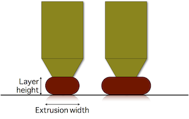
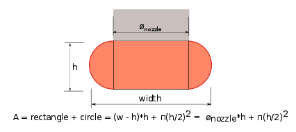
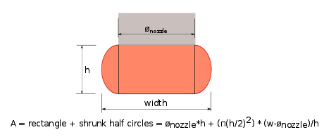
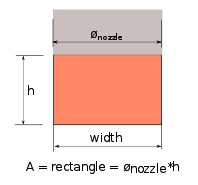

% Flow Math

This page explains the math used in Slic3r to determine the amount of flow. Documenting it serves as reference and as request for comments since better models might be worth to try.

#### Understanding extrusion width

Two main questions affect Slic3r's work:

1. **How distant** should extrusion paths be positioned in order to get a good continuous finish?
2. **How much material** must be extruded along such paths?

If two adjacent paths are **too close** (or **too much material** is extruded), they'll overlap. If two adjacent paths are **too distant** (or **not enough material** is extruded), gaps will be visible and/or the extrusions will delaminate because of not enough bonding.

By extruding more or less while moving (i.e. by changing the **flow speed/head speed ratio**) we can make paths thicker or thinner:

**Thicker paths** will have **better bonding** with the lower layer, thus are good for mechanical parts. However, they'll be less able to approximate the object shape and fill tiny gaps or narrow curves (think of a drill bit: a larger one will not be able to enter narrow places). On the contrary, **thinner paths** will provide less bonding but better shape accuracy.

However note that extrusion width can be controlled only when extruding over an existing surface (such as a previous layer or print bed). If we extrude in **free air** (i.e. when bridging), the resulting shape will be always **round** and equal to the **nozzle diameter**:

Actually, if you reduce the material flow you'll get smaller circles to some extent, until the plastic viscosity decides it's time to break your bridge because of too much tension. If, on the contrary, you extrude too much material, the shape of the extruded filament won't change (still equal to nozzle diameter) but you'll get a loose bridge.

So, let's start from a definition:

> Extrusion Width is the **thickness of a single filament** extruded either in free air or above a surface. It's **not** the distance of two adjacent paths since some overlap will be generally applied in order to get better bonding.

#### Bridges: the easy case

As said above, there's only one correct flow rate for bridging: the one that doesn't make your bridge sag or break. Extrusions are **round** and their **diameter is equal to the nozzle diameter**. Parallel paths will be positioned so that they are **tangent**, thus the spacing between one path and its neighbor is equal to nozzle diameter as well. (In case of bridges, we want no overlap because it has proven to drag the existing paths.)

The required material volume for a path of unitary length is calculated accordingly to the cylindric shape, thus with a circular cross-sectional area:

	E = (nozzle_diameter/2)^2 * PI

#### Extruding on top of a surface

In this case the problem is: **what shape** will our extrusion get? We know it will get squashed horizontally, but will it have a rectangular or oval shape? What's the maximum extrusion width we can get with a given nozzle diameter before plastic starts curling at the sides?

Slic3r assumes that the cross-sectional shape of an extrusion is a rectangle with semicircular ends. So the relationship between desired extrusion width and volume to extrude is the following:

If we reduce flow, at some point the shape will change. This is the last shape that has semicircular ends:

If extrusion gets more narrow, we assume it will have the following shape:

When target extrusion width coincides with nozzle diameter we assume a rectangular shape:

When target extrusion width is thinner than nozzle diameter the shape is unpredictable so we just use the same rectangular formula but discourage usage of such thin extrusion values.

The combination of the above formulas is a single continuous function that correlates the target extrusion width with the amount of material to extrude per distance unit:

`E = f(extrusion_width, layer_height)`

#### Spacing paths

Okay, now we we know how much to extrude to make a single path of the desired width. But **how much should we overlap** paths in order to get perfect bonding?

Supposing no overlap, thus tangent paths, there would be empty space (yellow):

The cross-section area of such voids is generally:

`void_area = extrusion_width - (layer_height/2)^2 * PI`

Ideally, we would want to fill all of that yellow area by placing the extrusions closed to each other. However, it's very unlikely that the second extrusion will fill the space below the previous one, so there would still be a little void. The ideal overlap would be something like:

`0 < overlap_factor*void_area < void_area`

with `overlap_factor` ranging from 0 to 1. In the past, several values were tried for `overlap_factor`, but some users were still seeing too sparse paths. A value of 1 is currently being used.

Path spacing is thus:

`spacing = extrusion_width + height*(1 - PI/4)`

#### Sane defaults

Slic3r allows users to define extrusion width manually for each kind of extrusion (perimeters, infill, support material etc.) but will calculate sane defaults if no custom values are entered.

For the **outermost loop** of perimeters (aka *external perimeters*) Slic3r will default to a **thin extrusion width**, equal to `nozzle diameter * 1.05`. This is considered the thinnest safe extrusion width. A thin extrusion width provides **better accuracy** to the object shape and minimizes the flow errors caused by irregular filament.

Extrusion width for other things is calculated by getting the cross-sectional area of the configured nozzle diameter and then calculating the extrusion width produced by extruding that amount of material. In other words, by **matching flow speed and head speed**. The purpose of this logic is to find the "native" flow that minimizes side forces during extrusion. Such calculated extrusion with is capped to max value equal to `nozzle_diameter * 1.7`, except for internal sparse infill where the full native flow is used.

