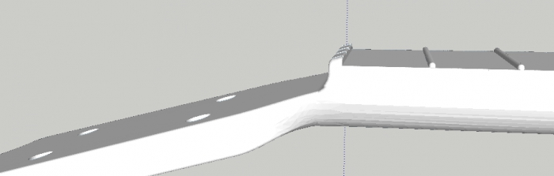
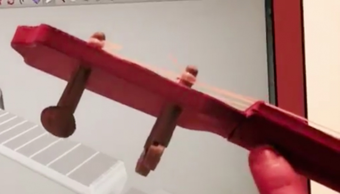
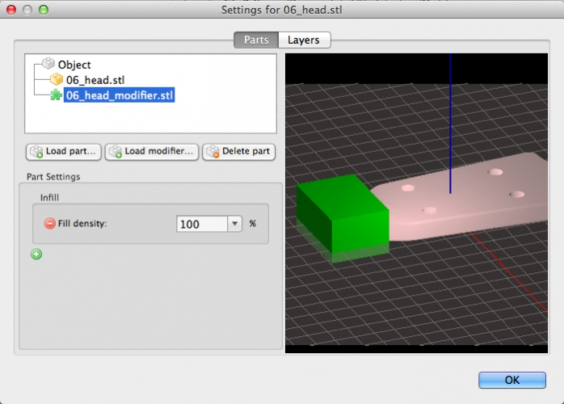
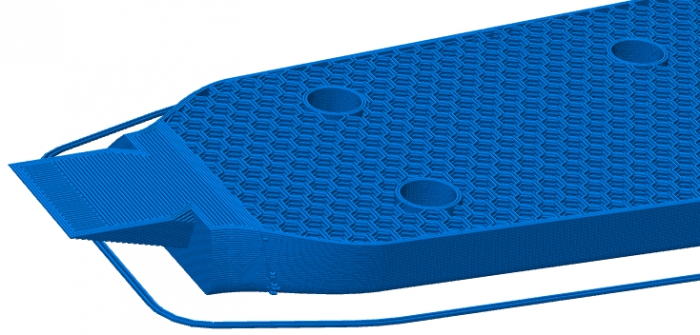
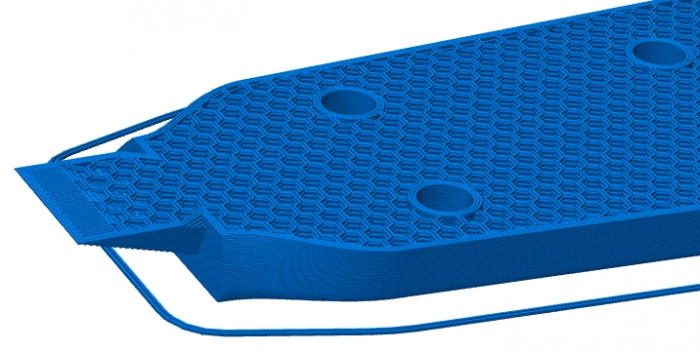
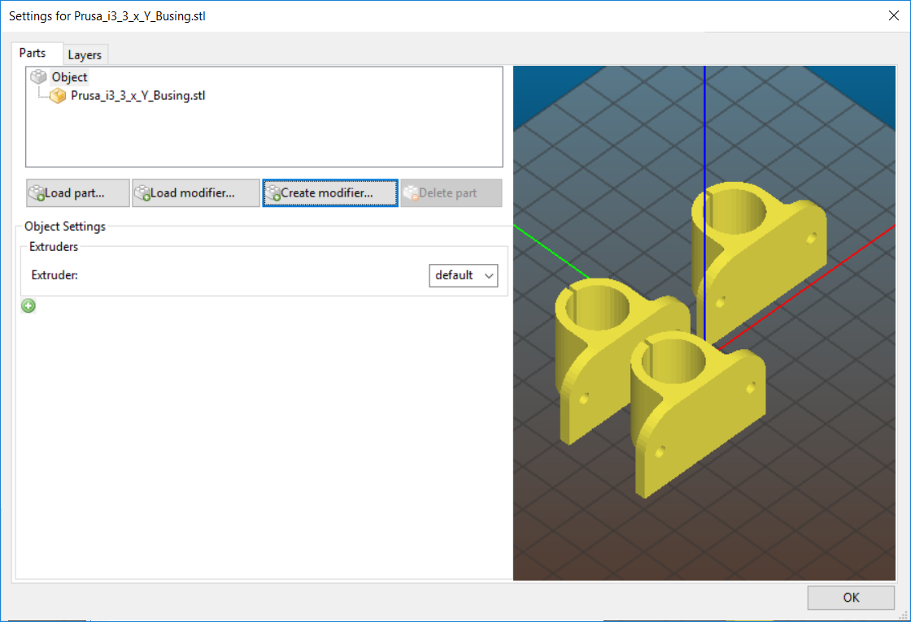

% Modifier Meshes

# Overview

Modifier meshes are one of the most advanced features of Slic3r. With them, you
have the ability to apply distinct settings to parts of objects. In fact Slic3r
allows users to define regions where the print settings should be overridden by
distinct settings.

For this example, we use this printable
[ukulele](http://www.thingiverse.com/thing:199298) design.

During assembly, it was noted that string tension may break the instrument or
bend it too much. Nothing happened to the instrument body and neck. However,
the head got bent a bit too much. This is how it should have been:

And this is how it turned out after tensioning strings:

The joint designed was too flexible for the strains involved:

So, at this point there would have been three possible solutions:
* redesign the parts with a larger joint (not much possible without altering the
  external shape of the instrument)
* print the head with 100% solid infill
* print just the joint area with 100% solid infill

The first option is exceedingly difficult without altering the external shape
of the instrument. Printing the entire head at 100% solid infill would work,
but would extend the printing time and generally waste material.

The third option permits is a "just right" solution: only the areas that
absolutely need to be at 100% infill are printed as such. However, with normal
CAD workflows this would require a separate part for the joint. Enter modifier
meshes.

In this example, a CAD application was used to model a simple volume around the
area that was desired to print with solid infill:

It was exported as a separate STL file, with its coordinates relative to the
part being modified.

Finally, Slic3r was opened and the main part was loaded. Right-clicking on the
main part brought up the object settings menu. From there, clicking "Load
Modifier" and selecting the previously saved model adds it to the part as a
modifier.

The green "+" was selected and "Fill Density" was added to modifier list and
set to 100%.

This is the comparison between a print with the modifier and without modifier.
Note the solid area near the joint:

Modifiers are a different and powerful way for specifying multi-part objects:
instead of importing multiple volumes that define the object shape, you can
import a special volume that overlaps with the object and defines a part by
subtracting it from the rest of the object.

# Lambda Modifier Meshes

With Slic3r 1.3.0, you can define simple shapes and position them in Slic3r
itself, instead of needing a separate CAD program. This new feature is called
*Create Modifier*. I tend to call it "lambda modifier meshes", after the
programming concept of lambda (anonymous) functions.

To use one of the new meshes, click on the *Create Modifier* button.

There are four different volumes available:
* Slab defines a rectangular prism with the X and Y size fixed to the size of
  the model being modified, with the height in Z being user-configurable. It is
  the easiest to work with and position.
* Box is another rectangular prism that gives you control over all three
  dimensions.
* Cylinder gives you control over the radius of a circle and the height.
* Sphere has one attribute: the radius of the sphere.

Once you select the desired type and click "Ok" the modifier mesh is added to
the part. Select it and you may add attributes to it as you wish.

The three sliders at the bottom allow you to control the X, Y, and Z
positioning of the modifier mesh. This works for any modifier mesh.

# Extra Tricks
## Scripted Mesh Design

If you find yourself needing a modifier mesh that corresponds to "every N
layers" or something similar, there is a JSCAD script available at [Slic3r
Github](https://github.com/alexrj/Slic3r/blob/master/utils/modifier_helpers/layer_generator.jscad).
Load it into [OpenJSCAD](http://openjscad.org) and you can import the resulting
modifer mesh into Slic3r.

## AMF Export
AMF Export includes all modifier meshes (and changed pieces) on a part.

(Overview adapted from [Slic3r blog entry](http://slic3r.org/blog/modifier-meshes))
