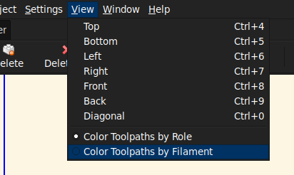
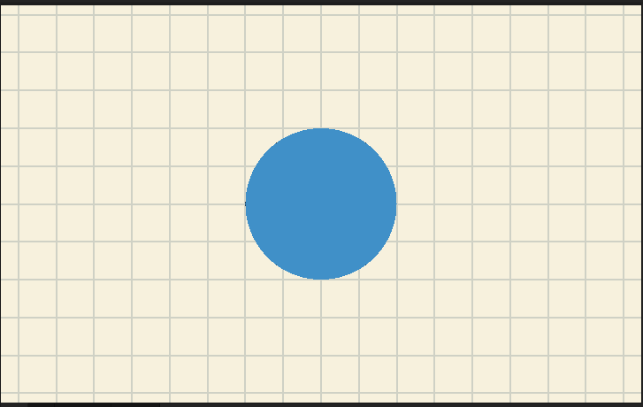
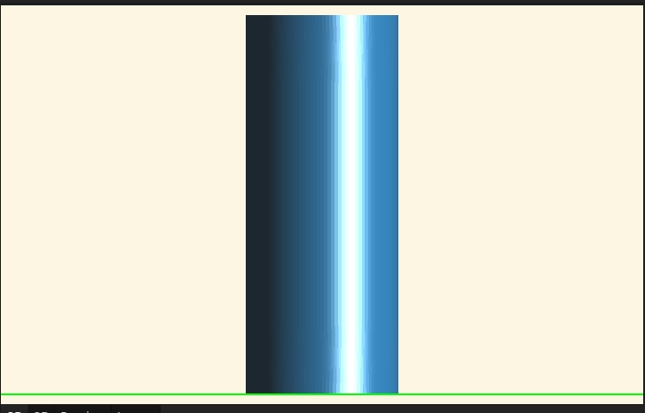
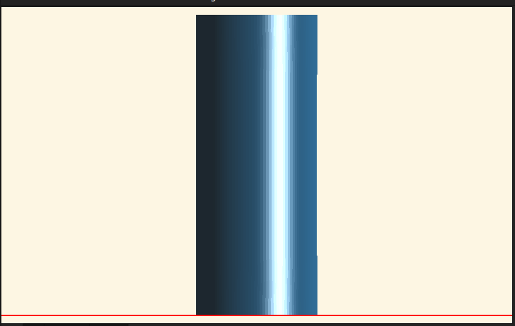
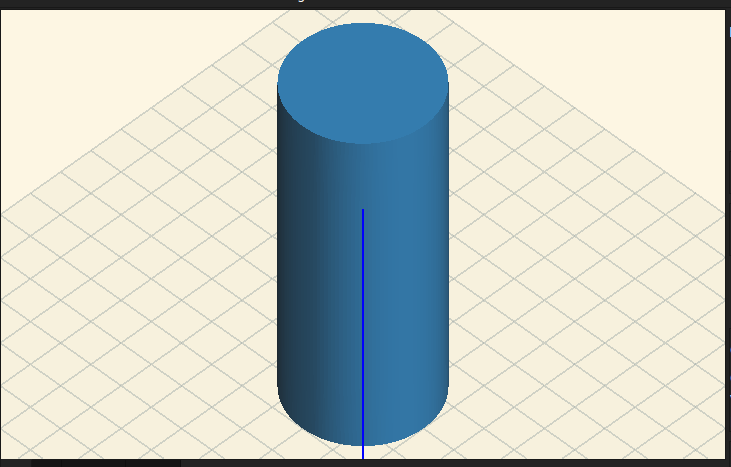
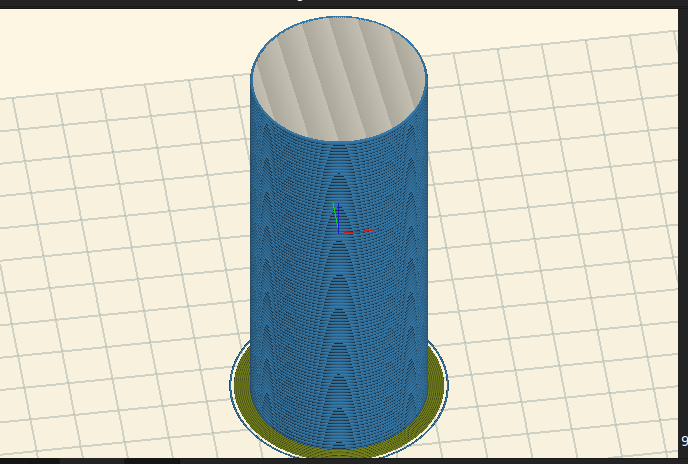

Plater Features
---------------

Slic3r's plater is powerful and contains many useful options. 

### View Menu

The View menu in Slic3r contains a few commands and one configurable preference/option. 
  

- Top (Ctrl+4): Immediately rotate the plater to a top-down view.
  
- Bottom (Ctrl+5): Immediately rotate the plater to a bottom-up view.
  
- Left (Ctrl+6): Immediately rotate the plater to a profile view of the left side of the plater.
  
- Right (Ctrl+7): Immediately rotate the plater to a profile view of the right side of the plater.
  
- Front (Ctrl+8): Immediately rotate the plater to a profile view of the front side of the plater.
  
- Back (Ctrl+9): Immediately rotate the plater to a profile view of the diagonal side of the plater.
  
- Diagonal (Ctrl+0): Immediately reset the plater to the initial view.
  

There are two ways to view the coloration in the 3D preview:
- Color Toolpaths by Role
    - This mode uses the regular Slic3r color scheme to pick the colors (default, Solarized, etc). 
  
- Color Toolpaths by Filament
    - This mode uses the specified colors from the selected Material profiles. 
  

