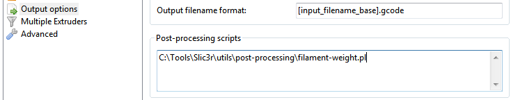

% Post-Processing Scripts

There may be times when the G-Code generated by Slic3r has to be tweaked
or modified after it has been created. For this reason there exists the
ability to run arbitrary scripts as part of the final steps in the
slicing process.

Example scripts can be found in the [GitHub repository](https://github.com/alexrj/Slic3r/tree/master/utils/post-processing)
or in the [RepRap forum](http://forums.reprap.org/list.php?263).

**Note:** post-processing scripts can be written in **any language**
(Perl, Python, Ruby, Bash etc.). They just need to be executable and to 
accept the path to the G-code file as the only argument.

In the `Output options` section of the `Print Settings` tab lies the
`Post-processing scripts` option. The absolute path to each script can
be added, separated by semicolons. Each scripts should be recognised by
the host system, and be executable.

Each script will be passed the absolute path of the G-code file that
Slic3r generates. The script will need to modify it in-place; alternatively
it can output the new G-code to a temporary file and then overwrite the original
one with it.

All Slic3r configuration options are made available to
the scripts by way of environment variables. These all begin with
`SLIC3R_`, for example `SLIC3R_LAYER_HEIGHT`. The following script would
leave the G-code unmodified and just write out all Slic3r options to standard
output:

    #!/bin/sh
    echo "Post-processing G-code file: $*"
    env | grep ^SLIC3R

For security reasons you can't supply arguments to the scripts. However, you
can just write a wrapper script.

Perl example
------------

Perl's in-place mode (`perl -i`) makes it easy to modify the contents of
the G-Code file, without having to copy, edit, then replace the
original. The following example will simply output the contents to
standard output:

    #!/usr/bin/perl -i
    use strict;
    use warnings;

    while (<>) {
         # modify $_ here before printing
         print;
    }

If you are getting a *can't do inplace edit without backup* error when specifying
the post-process script, try adding `$^I = '.bak';` before the while loop. This will
create a backup file of the generated G-Code file. Windows does not like to have two
scripts creating and/or accessing a single file at once, so a backup is needed.
