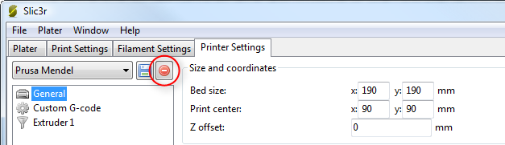
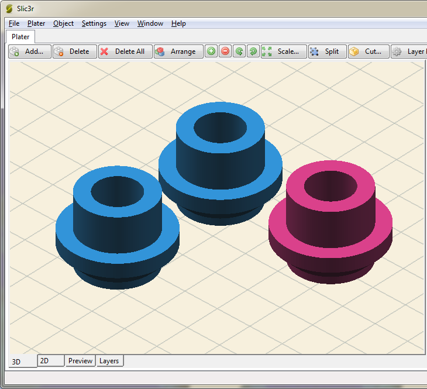
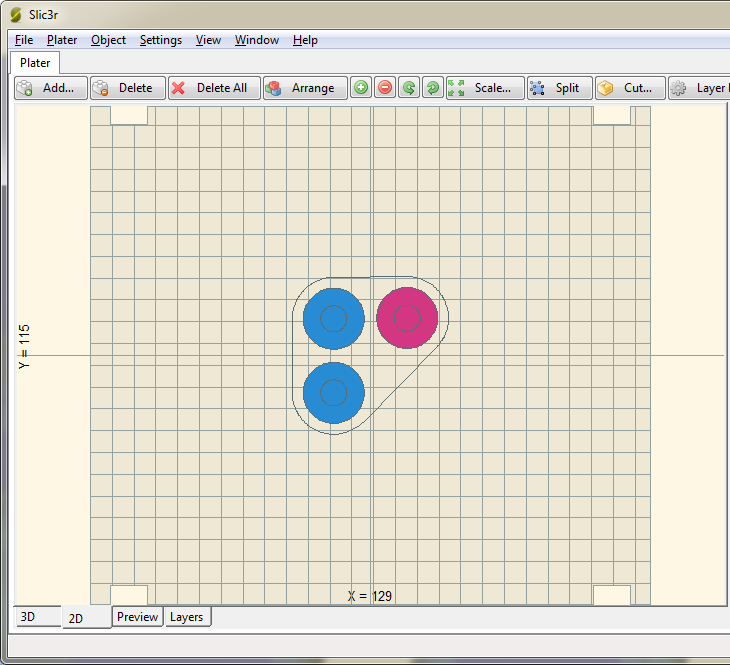
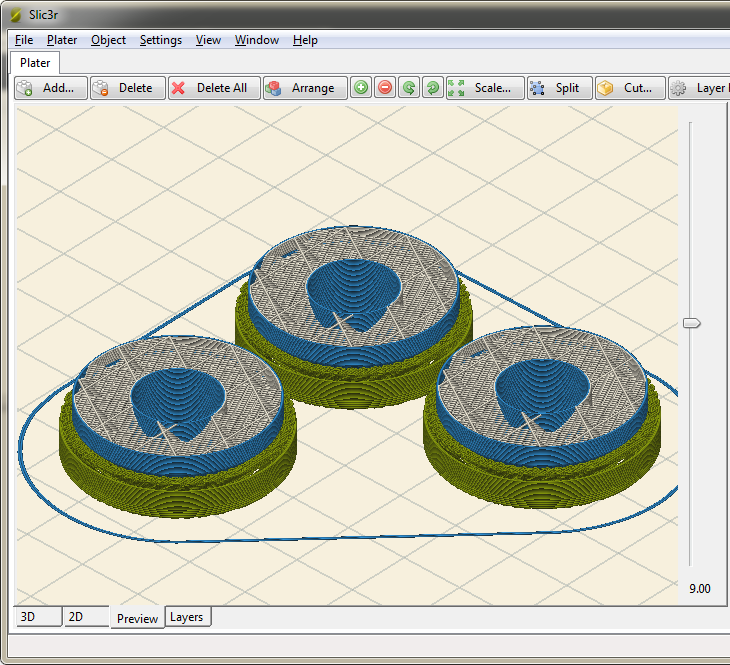
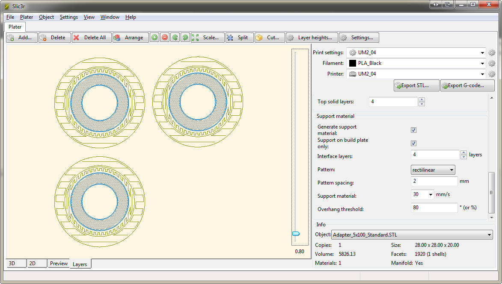

% Configuration Organization

Profiles
========

Configuration in Slic3r is organized across three categories:

* **Printer Settings**: these options define capabilities of the printer(s). You rarely need to change these option after the initial setup of a new printer.
* **Filament Settings**: these options define filament-specific properties, such as diameter, temperatures and cooling.
* **Print Settings**: these options define the "build styles" that you can use for each print. For example you might want to have distinct profiles for vases, mechanical objects, high quality models, drafts and so on.

From the main view (the plater) you can quickly select the profiles you want to use for printing: a printer, a filament and a print style.

Creating Profiles
-----------------

Open the desired tab and change the settings as necessary. Once
satisfied, click the save icon to the left above the setting titles, and
give a suitable name when prompted.


Profiles can be deleted by choosing the profile to delete and clicking
the red delete button next to the save button.




Exporting and Importing
=======================

If you want to transfer your settings to another computer, or send them via e-mail, or store them along with your models, you can use the `Export Config...` command in the File menu. This will save all the values of the currently selected presets into a text file having a `.ini` extension. These files can be easily loaded back with the `Load Config...` command.

Note that loading a config file doesn't store it as a preset automatically, so it will be not remembered the next time you launch Slic3r. If you want to store it you'll have to go through the *Print Settings*, *Filament Settings* and *Printer Settings* sections and hit the "Save" button for each section you want to create a preset in.

The `Export Config Bundle...` allows to export the **entire** set of profiles to a single file (not just the selected profiles). This is handy if you want to clone a Slic3r setup from one computer to another, or make a backup.

Import Configuration from GCode
-------------------------------

If you want to use the same settings/configuration from model B in your model A, you can do so by simply importing the GCode-file from model B.
In `File` choose `Import Config from GCode-File...` and select your previously saved GCode (model B) file.

When you click `OK` on your model B, a new `.ini` file will be created in the same directory as your model B. It's named just like your model B: `<name-of-model-B>.ini`. After the file has been created, it will automatically be imported in Slic3r. This `.ini` file holds your settings and could also be shared with others without revealing your CGode.

Note that this only works for GCode files which were sliced using Slic3r. Also, these settings are not stored in Slic3r.

Using a Custom Data Directory
=============================

By default, Slic3r stores its settings and profiles into a system directory, which depends on the operating system. Users are not supposed to touch such application preferences directories, so they're chosen automatically. However, Slic3r has a `--datadir` command line option that allows to use a custom directory. This can be useful for several customizations, such as keeping multiple Slic3r copies on a single computer, or for sharing configuration files across network.

Sharing Configuration across Network
------------------------------------

If you have a network-mounted device you can simply launch Slic3r with the `--datadir` option pointing to the custom directory, for example:

```
slic3r.exe --datadir Z:\Slic3r-settings
```

On Linux and MacOS X you have another option instead of using `--datadir`: a link to the shared directory can be created where Slic3r looks for the default directory. This can used for example for synchronizing Slic3r presets using Dropbox. The first step is to find the path where Slic3r looks for its configuration:

```
$ /Applications/Slic3r.app/Contents/MacOS/slic3r --debug
wxWidgets version wxWidgets 2.9.4, Wx version 0.9922
Data directory: /Users/al/Library/Application Support/Slic3r
```

Now, after closing Slic3r, we move this directory to our shared folder:

```
mv "/Users/al/Library/Application Support/Slic3r" ~/Dropbox/Slic3r-settings
```

(Double quotes are needed because of the space in the path, but if you're doing this you should already know how to work with the terminal.)

And finally we create a symbolic link:

```
ln -s ~/Dropbox/Slic3r-settings "/Users/al/Library/Application Support/Slic3r"
```

Using another Color-Scheme
==========================

Simple Usage
------------

To use another color scheme, you can switch from the default to Solarized (by Ethan Schoonover: http://ethanschoonover.com/solarized).
Go to `File` -> `Preferences` -> `Color Scheme` and choose `Solarized` (or leave at default). Click `OK` and restart Slic3r.

All viewport colors have been changed to a reduced brighness contrast.








Advanced Usage
--------------

Check out the file:

```
./lib/Slic3r/GUI/ColorScheme.pm
```
for comments on how to create your own color-scheme or just change the colors.
