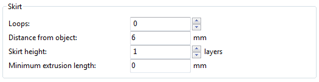

% Skirt

The `Skirt` setting adds an extrusion a short distance away from the
perimiter of the object. This can ensure that the material is flowing
smoothly from the extruder before it starts on the model proper.

 

-   `Loops` - How many circuits should be completed before starting on
    the model. One loop is usually sufficient.

-   `Distance from object` - The millimeters between the object and the
    skirt. The default of 6mm is usually sufficient.

-   `Skirt height` - The number of layers to lay down a skirt for. For
    ensuring the material is flowing smoothly, one layer is sufficient,
    however the skirt function can also be used to build walls around
    the object in case it should be protected from draughts.

-   `Minimum extrusion length` - Dictates a minimum number of
    millimeters that the skirt should be, should the loop around the
    object not be enough.

