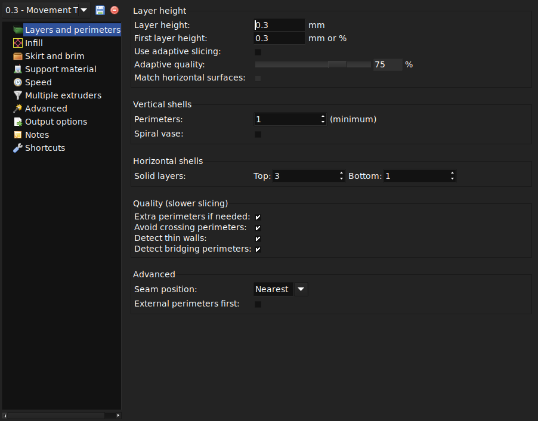
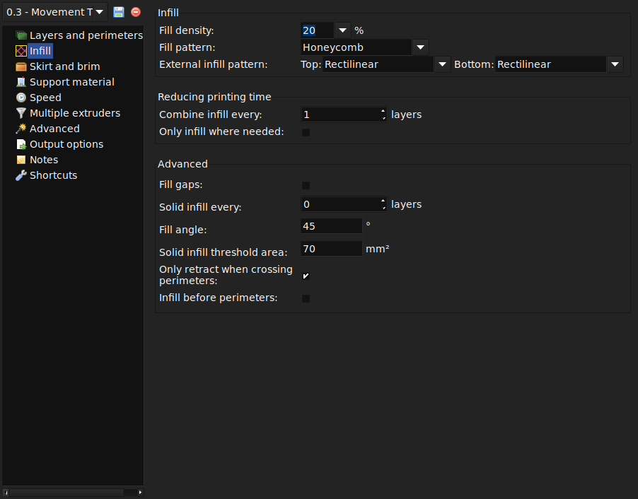
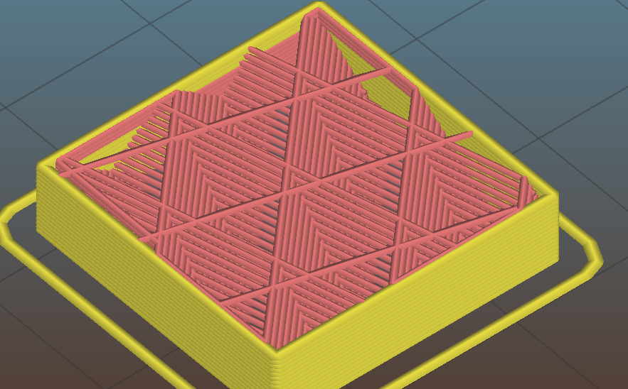
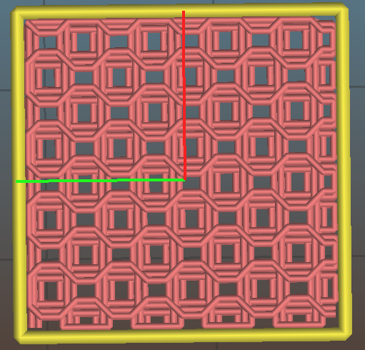
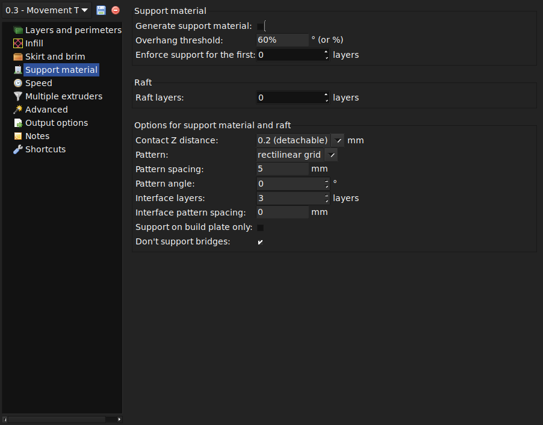
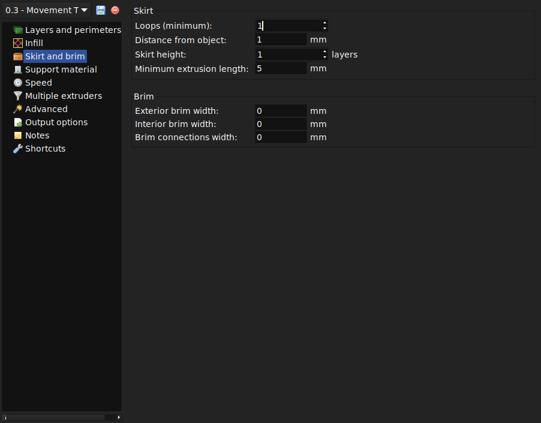

% Print Settings

This page will provide an overview of the available configuration settings in
Slic3r. Every configuration option has a tooltip and it is recommended to read
those tooltips. 

Print Settings
--------------

The `Print Settings` tab provides the opportunity to change settings
related to the actual print. Whereas the other tabs are changed rarely,
the settings on this tab will be modified regularly, possibly for each
model printed.

#### General.

`Layer height` is the thickness of each layer, and it is the step along
the vertical axis taken before extruding a new layer atop the previous
one. There are several factors that influence how high each layer should
be:

-   **Desired resolution** - Lower layer height should result in prints
    with less noticeable ribs or bands, as each layer is smaller.
    Aesthetics plays a role here, but also the type of model, for
    example, a mechanical part may not need such a high resolution
    finish, whereas a presentation piece may do so.

-   **Print speed** - Shorter layers will result in smoother prints but
    each print will take longer, simply because the extruder must trace
    the pattern more times. A later goal will be to strike a balance
    between layer height, the speed of the printer, and the quality of
    the resulting print.

`Perimeters` defines the minimum number of vertical shells (i.e. walls)
a print will have. Unless the model requires single width walls it is
generally recommended to have a minimum of two perimeters as this gives
some insurance that if a section of the perimeter is not printed
correctly then the second perimeter will help cover it.

The upper and lowermost layers that sandwich the model are filled with a
`Solid layers` pattern. For the bottom layers the important factor to
consider is how the surface will look should there be a mistake whilst
laying down the first layer, and for this reason it is recommended to
have at least two bottom layers.

A similar consideration is required for the top layers. Because the
intermediate layers are likely to be filled with a pattern set less than
100% then the covering layers will have to bridge this pattern and this
can require more than one pass to cover completely.

  

Another tip to consider: Setting the top solid layer to zero, and
setting the infill also to zero, will result in a hollow receptacle,
ideal for turning models into vases[^1] for example. Here manipulating
the settings within Slic3r can be used to generate different kinds of
prints, and not only be used to control surface accuracy.

 

#### Infill.

`Fill density` is from 0% to 100%.  it makes no sense to 100% fill the model
with plastic, this would be a waste of material and take a long time. Instead,
most models can be filled with less material which is then sandwiched between
layers filled at 100% (see `Solid layers` above).

A density value of 40% is enough to give almost all models good
mechanical strength. A value of 20% is usually the minimum required to
support flat ceilings.

Slic3r offers several fill patterns which will be discussed in more
depth in section  - Infill Choices.
Choosing a `Fill pattern` will depend on the kind of model, the desired
structural strength, print speed, and personal taste. The more exotic
fill methods are usually too slow and unnecessarily complex for most use
cases, and so most of the time the infill pattern is either
`rectilinear`, `line`, or `honeycomb`. Honeycomb gives the most strength
but is slower than both rectilinear or line.

##### Infill Patterns

There are several considerations when choosing an infill pattern: object
strength, time and material, personal preference. It can be inferred
that a more complex pattern will require more moves, and hence take more
time and material.

Slic3r offers several infill patterns, four regular, and three more
exotic flavours. The numbers given in brackets below each figure are a
rough estimate of material used and time taken for a simple 20mm cube
model[^2]. Note that this is only indicative, as model complexity and
other factors will affect time and material.

  

 

 

  

 

 

 

Certain model types are more suited for a particular pattern, for
example organic versus mechanical types. Figure
 shows how a honeycomb fill may
suit this mechanical part better because each hexagon bonds with the
same underlying pattern each layer, forming a strong vertical structure.

 

Most models require only a low density infill, as providing more than,
say, 50% will produce a very tightly packed model which uses more
material than required. For this reason a common range of patterns is
between 10% and 30%, however the requirements of the model will
determine which density is best. Figure 
shows how the patterns change as the density increases.

  

There are several 3D patterns available for 3d infill as well.

- `Cubic` infill is a 3D cube pattern with each cube stacked on corners.
 

- `3D Honeycomb` is a true honeycomb pattern.
 

##### Infill Optimization
Slic3r contains several advanced infill settings which can help produce
better extrusions.

-   `Infill every n layers` - Will produce sparse vertical infill by
    skipping a set number of layers. This can be used to speed up print
    times where the missing infill is acceptable.

-   `Only infill where needed` - Slic3r will analyse the model and
    choose where infill is required in order to support internal
    ceilings and overhangs. Useful for reducing time and materials.

-   `Solid infill every n layers` - Forces a solid fill pattern on the
    specified layers. Zero will disable this option.

-   `Fill angle` - By default the infill pattern runs at 45° to the
    model to provide the best adhesion to wall structures. Infill
    extrusions that run adjacent to perimeters are liable to de-laminate
    under stress. Some models may benefit from rotating the fill angle
    to ensure the optimal direction of the extrusion.

-   `Solid infill threshold area` - Small areas within the model are
    usually best off being filled completely to provide structural
    integrity. This will however take more time and material, and can
    result in parts being unnecessarily solid. Adjust this option to
    balance these needs.

-   `Only retract when crossing perimeters` - Retracting, to prevent
    ooze, is unnecessary if the extruder remains within the boundaries
    of the model. Care should be taken if the print material oozes
    excessively, as not retracting may result in enough material loss to
    affect the quality of the subsequent extrusion. However, most modern
    printers and materials rarely suffer from such extreme ooze
    problems.

-   `Infill before perimeters` - Reverses the order in which the layer
    is printed. Usually the perimeter is laid down initially, followed
    by the infill, and this is usually the preferable as the perimeter
    acts as a wall containing the infill.

#### Support material.

 Printing a model from the bottom up, as
with FDM, means that any significant overhangs will be printed in the
air, and most likely droop or not print correctly. Choosing support
material (`Generate support material`) will add additional structures
around the model which will build up to then support the overhanging
part. The `Pattern spacing` option determines how dense the support
material is printed.

 

Tip: It is sometimes worth considering altering the orientation of the
model in order to possibly reduce overhangs.

`Raft layers` will add additional layers underneath the model and stems
from the early days of 3D printing. It can help with prints without a
heated bed, or where the bed is not very flat, but it is usually not
required and is not recommended. The raft also requires post-processing
to remove it.

#### Speed

There are two general categories of speeds: print moves and non-print moves. 

For print moves, each type of printing move can be configured to have a
different speed, either in absolute terms (mm/s) or as a percentage of the the
more general move.

-   `Perimeters` - The outline of the model may benefit from being printed
    slightly slower so that the outside skin of the print has fewer blemishes.

    -   `Small perimeters` - Meant for holes, islands and fine details, a
        slower speed here is recommended.

    -   `External perimeters` - A slightly slower value may ensure cleaner
        surfaces.

-   `Infill` - As the infill is hidden this can be extruded a little
    faster. Take care though not to go too fast as higher speeds results
    in thinner extrusions, and this may affect how the extrusions bond.

    -   `Solid infill` - The bottom of the model, and any additional solid
        layers is usually slightly slower than infill but faster than
        perimeters.

    -   `Top solid infill` - Allow time for the extrusion to cleanly cover
        the previous top layers and result in a tidy top surface. the last
        few layers should have bridged the infill structure nicely,
        preparing the way for a neat finish.

    -   `Gap fill` - Filling in small gaps results in the extruder quickly
        oscillating and the resulting shaking and resonance could have a
        detrimental affect on the printer. A smaller value here can guard
        against this. Gap fill may be disabled in the 'Infill' settings.

-   `Bridges` - Having the extrusion span distances depends on the
    material and cooling. Going too slow will result in sagging, too
    fast will result in broken strands. Experimentation is the key here,
    but generally bridging runs slower than perimeters.

-   `Support material` - These are used if any support material (including
    rafts and brims) is included in the print. Usually it is printed as thick
    as possible, so a high speed may cause flow rate issues.

The one non-print move is travel moves.

-   `Travel` - The jump between the end of one extrusion and the next
    should usually be performed as quickly as the printer will allow in
    order to minimise any mess caused by material oozing from the
    nozzle.

All print moves on the first layer may be changed with the provided modifier,
either as a flat percentage or a fixed speed.

##### Acceleration

If your printer firmware supports acceleration control, you can enter in values
here to change acceleration for the different general print moves.

##### Autospeed

If you set any print speed value to `auto`, configure the fastest printing
speed you want for this print and Slic3r will choose speeds itself in an
attempt to maintain constant pressure in the extruder.

Setting `Max volumetric speed` will tell Slic3r to not exceed the given flow
rate for any printing moves. Set it to 0 to disable this feature.

There are 2 experimental methods to derive the max extrusion rate:

1. Print fast and use live tuning via M221 until you see or feel the filament slipping in the extruder (easy on a standard UM, maybe more difficult on others, and it heavily depends on the extruder mechanism how much pressure it can deliver without slipping).
2. Perform the following extruder calibration routine (either manually in pronterface, or with some to-be-done tool): Heat the printe's hotend up a middle of the road temp (i.e. 210C for PLA), and push i.e. 20mm filament through the nozzle at a given speed (steps/sec or mm/sec), starting with i.e. 1mm/s, and observe whether or not the filament was slipping. If not, continue increasing the speed by 20%, and test again. If so, this value indicates a maximum extrusion rate for this temperature has been reached. 

##### Recommendations

Once the printer is reliably producing good quality prints it may be
desirable to increase the speed. Doing this provides several benefits,
the most obvious of which is that the results are produced quicker, but
also faster print times can be utilised in producing more layers, i.e.
lower layer height, thus improving perceived print quality. An
additional benefit is that a faster travel movement, between extrusions,
can reduce the effects of oozing.

The best approach is to increment the various speed parameters in small
steps and observe the effect each change has on print quality. Travel
speed is a safe starting point, and it is not unrealistic to attain
speeds of up to 250mm/s (if your printer can handle it). Adjusting the
speed of perimeters, infill is available in simple mode, and the general
rule is to have the perimeter go a little slower than the infill in
order to reduce possible blemishes on the surface (infill can be faster
because slight gaps will not matter as much).

#### Skirt and Brim

##### Brim

 `Brim width` is used to add more perimeters to the first layer, as a base
 flange, in order to provide more surface area for the print to stick to the
 bed with in order to reduce warping (see §). The brim is then cut away once
 the print is finished and removed from the bed. `Interior brim width` adds a
 brim inside of holes in the print.

 

##### Skirt

The `Skirt` setting adds an extrusion a short distance away from the
perimiter of the object. This can ensure that the material is flowing
smoothly from the extruder before it starts on the model proper.

-   `Loops` - How many circuits should be completed before starting on
    the model. One loop is usually sufficient.

-   `Distance from object` - The millimeters between the object and the
    skirt. The default of 6mm is usually sufficient.

-   `Skirt height` - The number of layers to lay down a skirt for. For
    ensuring the material is flowing smoothly, one layer is sufficient,
    however the skirt function can also be used to build walls around
    the object in case it should be protected from draughts.

-   `Minimum extrusion length` - Dictates a minimum number of
    millimeters that the skirt should be, should the loop around the
    object not be enough.

#### Extrusion Width

One reason for modifying the extrusion width has already been discussed:
increasing first layer extrusion width in order to improve bed adhesion
(see p.). There are some further cases where it may be beneficial to
modify extrusion widths.

-   `Perimeter` - A lower value will produce thinner extrusions which in
    turn will produce more accurate surfaces.

-   `Infill` and `Solid Infill` - A thicker extrusion for infill will
    produce faster prints and stronger parts.

-   `Top infill` - A thinner extrusion will improve surface finish and
    ensure corners are tightly filled.

-   `Support material` - As with the infill options, a thicker extrusion
    will speed up print time.

It is important to remember that if the extrusion width is expressed as
a percentage then this is computed from the `Layer height` property, and
not the `Default extrusion width` setting.

#### G-Code Output Options

##### Sequential Printing.

 This feature allows to compose a plate of objects but have the printer
 complete each one individually before going back to Z = 0 and starting with
 the next one. See the section about Sequential Printing in the Advanced Topics
 chapter.

##### Output File Options

- `Verbose G-Code` turns on extra comments to document the types of print moves in the output G-Code. Very useful for debugging. 
- `Output filename format` describes the general format for how Slic3r automatically names export G-Code files. All of the usual variables are supported here.

##### Post-Processing Scripts

Post-processing scripts are a powerful way to modify output G-Code after the slicing process has completed and as such have their own section in Advanced Topics.

[^1]: http://slic3r.org/blog/tip-printing-vases
[^2]: Taken from http://gcode.ws
