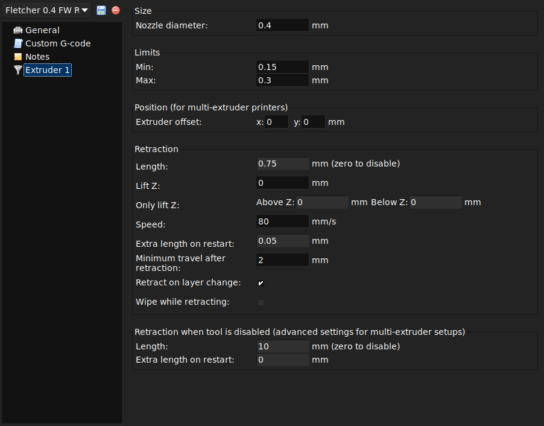
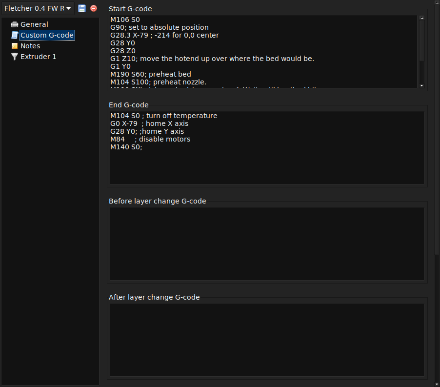
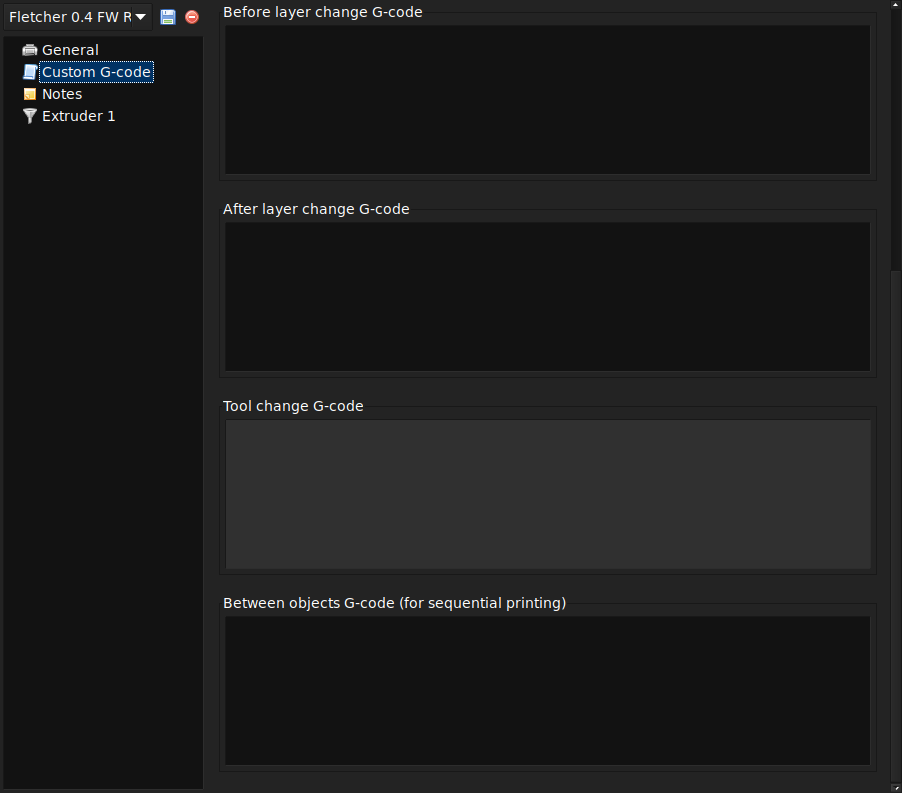

% Printer Settings

Printer Settings
----------------

The `Printer Settings` will be updated the least, unless Slic3r is going
to be used for many printers, for example, in a 3D printer farm.

 

#### Size and coordinates.

The `Bed size` setting is taken from the
wizard (see p.) and is only used for previewing the model in the plater.

The `Print center` is the point around which the print will be centered.
A `Bed size` of 200mmx200mm and a `Print center` of 100mmx100mm would
sit the print in the middle. Should it be desired to print away from the
center, because of a scratch in the glass perhaps, then this option
should be used.

`Z offset` can be used to compensate for an incorrectly calibrated Z
end-stop. If the nozzle stops slightly too far from the bed, then adding
a negative value will offset all layers by that amount. The correct
solution however is to fix the end-stop itself.

The optimal Z endstop position is where the nozzle tip barely touches
the surface of the bed when homed. A sheet of paper makes a good gauge
for this very small distance. It is not recommended to use this setting
to try and improve layer adhesion, by "squashing" the bottom layer into
the bed, instead look at the suggestions in the appropriate section.

#### Firmware.

As selected in the wizard (see p.), `G-code flavour`
defines the dialect of G-code generated.

### Extruder Settings

#### Extruder.

`Nozzle diameter` was defined in the wizard (see p.).

#### Retraction.

Unless the material being extruded has a very high
viscosity it may ooze between extrusions due to gravity. This can be
remedied by actively retracting the filament between extrusions. Setting
the `Length` parameter to a positive value will cause the filament to be
reversed by that many millimeters before travel. The retraction will
then be compensated for by the same amount after the travel move, before
starting the new extrusion path.

A value of between 1 and 2mm is usually recommended. Bowden extruders
may need up to 4 or 5mm due to the hysteresis introduced by the tube.
Setting the `Lift Z` parameter to a positive value will raise the entire
extruder on the Z axis by that many millimeters during each travel. This
can be useful to ensure the nozzle will not catch on any already laid
filament, however it is usually not necessary and will slow the print
speed. A value of 0.1mm is usually sufficient.

### Custom G-Code
#### Start, End and Layer Change G-Codes.

Custom G-code commands can be run before a print
starts and after a print finishes.

Placeholders can be inserted in the G-code commands[^1]. For example
[next\_extruder] would return the index of the next extruder.

The [RepRap wiki](http://reprap.org/wiki/G-code) is a good resource to learn
about the variety of G-codes available.

Note: Be sure to check that a given G-code is valid for your firmware.

The codes specified in `Start G-code` are inserted at the beginning of
the output file, directly after the temperature control commands for the
extruder and bed. Note that if temperature control commands are
specified (M104 and M190) then these will replace the temperature
G-codes introduced by the `Filament` settings.

Some common G-codes to use before the print starts are:

-   **G28** &ndash; Homes all the axes.

Some common G-codes to use after the print ends are:

-   **M104 S0** &ndash; Sets the extruder temperature to zero.

-   **M140 S0** &ndash; Sets the heated bed temperature to zero.

-   **G28 X0** &ndash; Home the X axis.

-   **M84** &ndash; Disables the motors.

[^1]: https://github.com/alexrj/Slic3r/wiki/FAQ\#what-placeholders-can-i-use-in-custom-g-code
