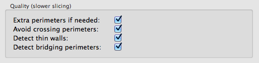

% Draft Quality

Several options can be disabled or tuned in order to achieve faster G-code generation speed and shorter print times.

### Print Settings > Layers and perimeters > Quality

These options provide nicer and cleaner objects but require more CPU time. They can be disabled for draft quality prints.

* `Extra perimeters if needed`: this feature checks whether adding more perimeters to sloping layers would help hiding the internal infill, thus make the object look nicer.
* `Avoid crossing perimeters`: this feature blends travel moves so that the nozzle stays fully inside or outside the object whenever possible, thus reducing the number of times it crosses perimeters and triggers a retraction. This prevents stringing but requires much CPU time during G-code export because complex motion planning algorithms are used for each single layer.
* `Detect thin walls`: this feature checks for collisions between perimeters. It ensures that the printer doesn't try to extrude too close paths, and uses the medial axis algorithm in order to transform thin walls into single-pass extrusions.
* `Detect bridging perimeters`: this feature detects the bridging/overhanging portions of perimeters and applies bridge flow/speed to them.

### Print Settings > Infill

The *Hilbert Curve*, *Archimedean Chords* and *Octagram Spiral* infill patterns are generally much slower. You might want to avoid them in your draft quality prints if you care about slicing speed.

### Print Settings > Advanced > Resolution

By default, Slic3r does not simplify the input geometry and will render all details into the output G-code for maximum accuracy. However, high-resolution models often carry more resolution than the printer is able to print, so they can be simplified especially when you want faster slicing. You can set the *Resolution* option to something like 0.05mm or even 0.1mm for your draft quality prints.

### Print settings > Advanced > Threads

(This hint applies to all kind of prints, not just draft quality.)
Many algorithms in Slic3r support parallelization using multiple threads. You should set this option to the number of processors or cores of your computer.
